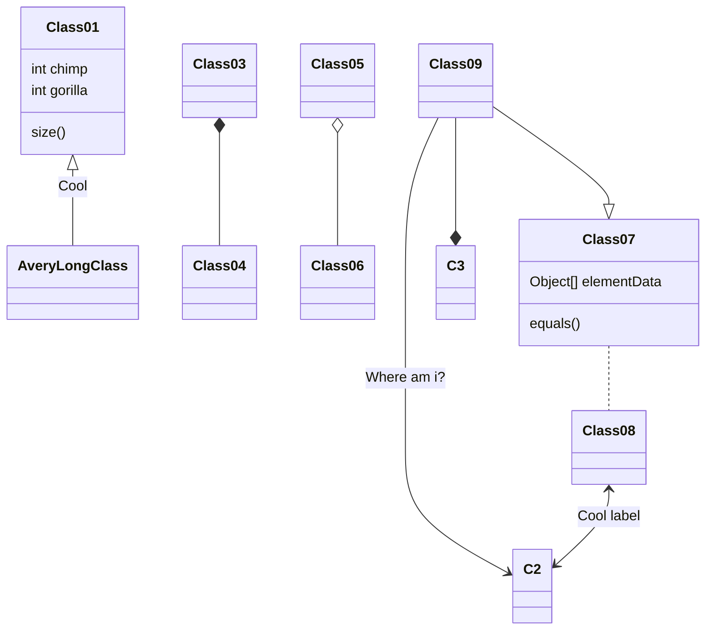
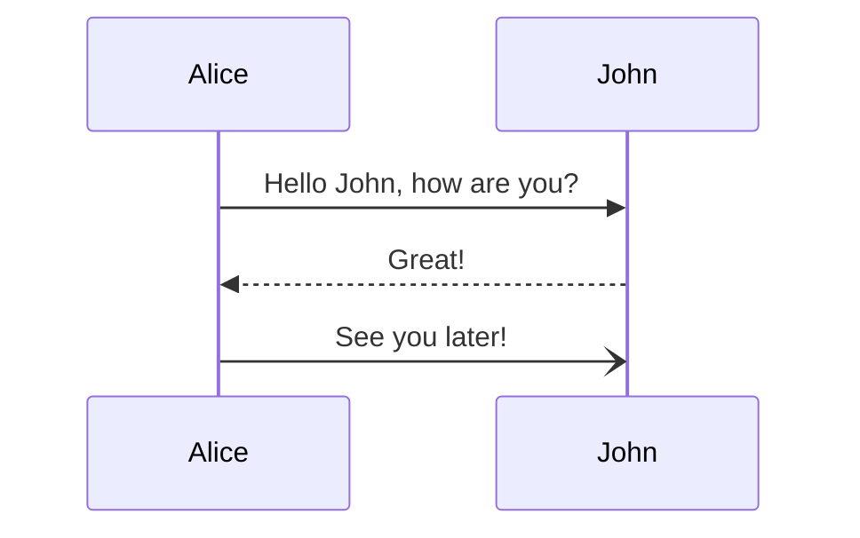

# Wiki

프로젝트 문서를 파일 구조를 이용하여 만듭니다. 문서는 마크다운 문법을 사용하여 작성합니다.

## 사전 준비
NodeJs를 먼저 설치해야 합니다.
* [Node.js](https://nodejs.org/en/) 설치

## 문서 구조
문서는 doc 디렉토리 아래에 작성합니다. 반드시 다음의 규칙을 따릅니다.

* 디렉토리에는 디렉토리를 설명하는 README.md 파일을 작성합니다.
  * 파일명은 대문자 README로 하고 확장자는 .md 입니다.
  * 디렉토에서 README.md 파일을 포함하여 다른 파일들에서 이미지 등을 사용하는 경우 디렉토리 안에 .assets 디렉토리를 만들고 그 안에 이미지 파일을 저장합니다.
* 목록을 순서대로 표시하기 위해서는 앞에 숫자를 붙입니다. 예) 01-install.md
* 문서의 첫번째 # 제목이 문서의 제목이 됩니다.


## 지원하는 마크다운 문법
다음의 문법을 지원합니다.

* 링크
* 이미지 링크
* 제목
* 강조
* 목록
* 테이블
* 유튜브 링크
* 링크


## 위키 구조 확인하기

### 외부 패키지 설치
다음을 실행하여 외부 라이브러리를 설치합니다.
```shell
npm install
```


### 서버 실행하기
개발환경에서 문서를 확인하기 위해서 간단한 웹서버를 실행합니다.  아래 명령어 들은 이 파일이 있는 디렉토리에서 실행해야 합니다.

```shell
npm run server
```
UI 서버를 실행합니다.
```shell
npm run dev
```
브라우저를 열고 다음으로 연결합니다.
```shell
http://localhost:5999
```

위 두가지를 한 번에 하려면 다음을 터미널에서 실행합니다.
```shell
npm run devserver
```

## 위키 문서 구조
이 프로젝트의 디렉토리 구조는 다음과 같습니다.
```shell
📂wiki(project's root)  
  📂doc   # 문서 
    📂api   # API 명세서  
    📂wiki  # 가이드 문서 
  📄README.md  # 이 문서 
```


## Wiki 문서 작성 규칙
Wiki 문서는 다음과 같은 규칙을 따라 작성합니다.
* 폴더를 만들때에는 폴더에 해당하는 README.md 파일을 만들어야 합니다.
* 목차파일은 다음 파일에 작성합니다.
    * wiki는 wiki 디렉토리의 README.md 파일입니다.
    * api는 api 디렉토리의 README.md 파일입니다.
* 이미지는 각 디렉토리 안에 .assets/ 디렉토리를 만들고 그 안에 이미지를 둡니다.
    * 이미지가 없으면 만들 필요는 없습니다.
* 시퀀스 다이어그램이나 클래스 다이어그램은 [mermaid 문법](https://mermaid-js.github.io/mermaid/#/)을 사용하여 작성합니다.

## 기타
다음 사항을 권장합니다
* Markdown 문서는 VS Code를 사용하면 편리합니다.

## 샘플 


아래는 유튜브 링크입니다.

https://youtu.be/tWjsgcHcC8Y


[your video](https://www.youtube.com/watch?v=9GKh3QJUj8Y&t=20) [your video](https://www.youtube.com/watch?v=9GKh3QJUj8Y&t=20)  [your video](https://www.youtube.com/watch?v=9GKh3QJUj8Y&t=20)


* 다음과 같이 Cipher 사용
```java
Cipher c = Cipher.getInstance("AES/CBC/PKCS5Ppadding");
PasswordUtils.hasPassword()
```

* MD5 줄 제거
* MailUser.java에서 MD5 주석 제거
    * OpenApiMsgService.java
```java
MessageDigest sh = MessageDigest.getInstance("SHA-1"); 
```

* 암호화를 하는 부분이 아닌 다운로드 받은 파일이 변조되지 않았는지  확인하기 위해서 hash 값을 생성하기 위한 것. 모바일 앱은 모든 고객사가  사용하는 부분으로 수정할 수 없음. 
* PasSHA1Encoder : 사용하는 곳이 없음
* wksMenuCfg.jsp
    * 아래 SHA,DES, CNC는 암호화 알고리즘 이름이 아닌 메뉴 약어임
```jsp
 <li><label><input name="wksMenuCfg_menu" type="checkbox" value="MEM" class="input_chk lst_chk"> <spring:message code="workspace.label.message375" text="회원" /></label></li>
57. <li style="display : none;">
58.  <input name="wksMenuCfg_menu" type="checkbox" value="SHA" class="input_chk lst_chk" checked>
59.  <input name="wksMenuCfg_menu" type="checkbox" value="DES" class="input_chk lst_chk" checked>
60.  <input name="wksMenuCfg_menu" type="checkbox" value="CNC" class="input_chk lst_chk" checked>
61. </li>
```


## Diagram

Mermaid




### Diagram

Mermaid





